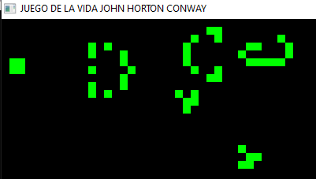

# juego-de-la-vida
El objetivo de este programa es recrear el famoso Juego de la Vida de Conway, un autómata celular diseñado en 1970 por el matemático John Horton Conway.

## Descripción

El Juego de la Vida es un "juego" de cero jugadores. Esto significa que su evolución está completamente determinada por el estado inicial y no requiere ninguna interacción posterior.

## El tablero

El "tablero de juego" es una malla bidimensional infinita compuesta por células cuadradas. Cada célula tiene dos estados posibles:

- Viva ("encendida").

- Muerta ("apagada").

Cada célula está rodeada por 8 células vecinas (horizontal, vertical y diagonal). El estado de todas las células evoluciona simultáneamente en pasos discretos de tiempo ("turnos"), siguiendo las reglas descritas a continuación.

## Reglas del juego

Nace: Una célula muerta con exactamente 3 vecinos vivos "nace" y pasa a estar viva en el siguiente turno.

Muere: Una célula viva muere en los siguientes casos:

- Sobrepoblación: Tiene más de 3 vecinos vivos.

- Aislamiento: Tiene 1 o ningún vecino vivo.

Sobrevive: Una célula viva permanece en ese estado si tiene 2 o 3 vecinos vivos.

## Representaciones visuales

### Pulsar:

### Generador de Naves Espaciales:

## Ejecución

Este programa simula el Juego de la Vida, permitiendo observar cómo evoluciona el tablero según el estado inicial. Puedes personalizar el tamaño del tablero, el número de turnos y las células vivas iniciales.

