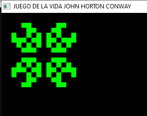

# juego-de-la-vida
el fin de este programa es recrear el famoso juiego de la vida de conway.

Se trata de un juego de cero jugadores, lo que quiere decir que su evolución está determinada por el estado inicial y no necesita ninguna entrada de datos posterior. El "tablero de juego" es una malla plana formada por cuadrados (las "células") que se extiende por el infinito en todas las direcciones. Por tanto, cada célula tiene 8 células "vecinas", que son las que están próximas a ella, incluidas las diagonales. Las células tienen dos estados: están "vivas" o "muertas" (o "encendidas" y "apagadas"). El estado de las células evoluciona a lo largo de unidades de tiempo discretas (se podría decir que por turnos). El estado de todas las células se tiene en cuenta para calcular el estado de las mismas al turno siguiente. Todas las células se actualizan simultáneamente en cada turno, siguiendo estas reglas:

Nace: Si una célula muerta tiene exactamente 3 células vecinas vivas "nace" (es decir, al turno siguiente estará viva).
Muere: una célula viva puede morir por uno de 2 casos:
Sobrepoblación: si tiene más de tres vecinos alrededor.
Aislamiento: si tiene solo un vecino alrededor o ninguno.
Vive: una célula se mantiene viva si tiene 2 o 3 vecinos a su alrededor.

